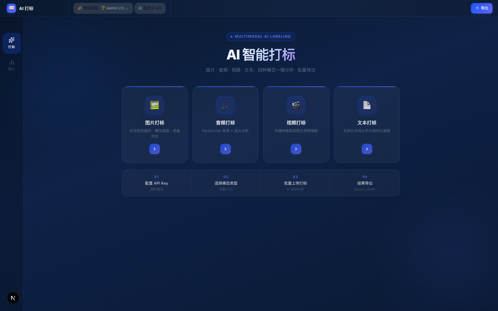
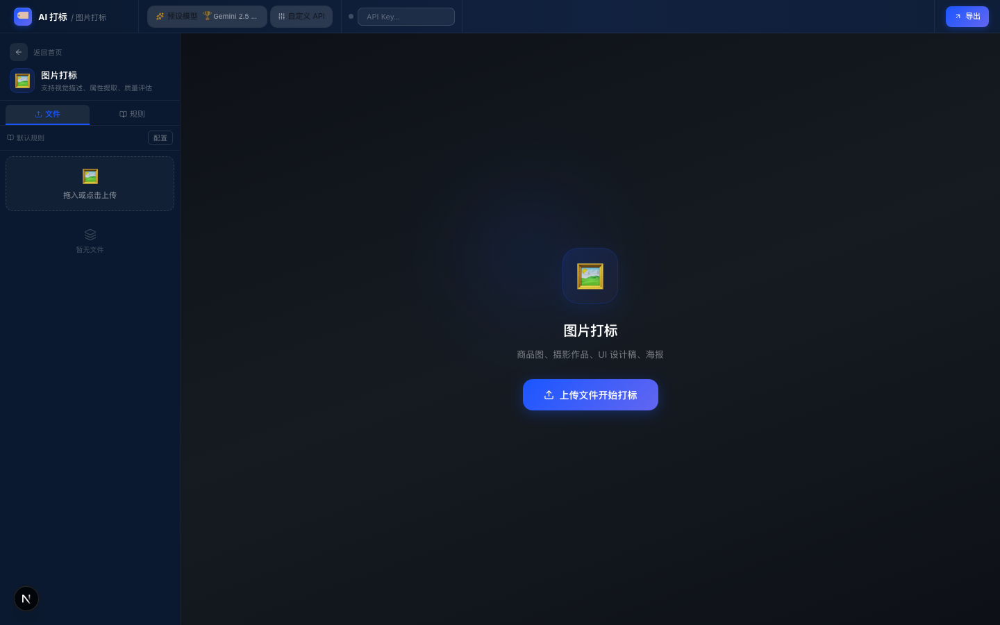
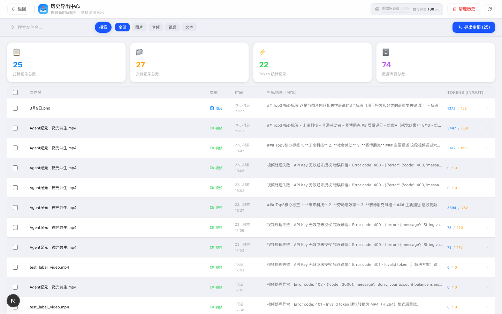

<div align="center">

# 🏷️ AI Labeler — 多模态 AI 智能打标平台

**Multimodal AI Labeling Platform**

[](https://nextjs.org)
[](https://fastapi.tiangolo.com)
[](https://python.org)
[](https://supabase.com)
[](LICENSE)

> 一站式批量打标工具，支持**图片 · 音频 · 视频 · 文本**四种模态，兼容 OpenAI / Gemini / Claude / Qwen 等主流 AI API，结果一键导出 Excel。

[功能演示](#-功能演示) · [快速启动](#-快速启动) · [系统架构](#-系统架构) · [English](#english)

</div>

---

## ✨ 核心功能

| 功能 | 说明 |
|------|------|
| 🖼️ **图片打标** | 视觉描述、属性提取、质量评分（清晰度/构图/色彩/商业价值） |
| 🎵 **音频打标** | Paraformer 语音转录 + 语义分析；支持 qwen-omni 直接音频输入 |
| 🎬 **视频打标** | 关键帧提取（提帧模式）或原生视频 URL（Qwen2.5-VL / Gemini 原生模式） |
| 📄 **文本打标** | 长文档分析，自动截断超长文本并标记，支持结构化提取 |
| ⚡ **批量处理** | 可配置并发数（默认 2），进度实时显示，失败自动标记可重试 |
| 🔌 **多 API 兼容** | OpenAI / Anthropic / Google Gemini / Qwen / DeepSeek / 硅基流动，切换零代码改动 |
| 📊 **Token 统计** | 按天/模型/模态分组统计消耗，折线图 + 饼图可视化 |
| 📤 **导出中心** | 历史结果分页查询、过滤、勾选批量导出 Excel（含 Top3 标签 + 校验列） |
| 🗂️ **规则库** | 可保存多套 Prompt 规则，按模态分类型配置，一键切换应用 |
| 🗑️ **数据清理** | 数据库用量监控，支持按天数范围清理历史记录 |

---

## 🎬 功能演示

> 📹 **演示视频（点击封面播放）**

[](https://github.com/RAIN-SV/ai-labeler/releases/download/v1.0.0/demo.mp4)

https://github.com/RAIN-SV/ai-labeler/releases/download/v1.0.0/demo.mp4

### 截图预览

| 一级首页 | 二级工作台 |
|---------|-----------|
|  |  |

| 模型配置面板 | 导出中心 |
|------------|---------|
|  |  |

> 📝 *截图文件放在 `docs/screenshots/` 目录*

---

## 🏗️ 系统架构

```
┌─────────────────────────────────────────────────────────┐
│                     Browser (User)                      │
└──────────────────────────┬──────────────────────────────┘
                           │ HTTP
┌──────────────────────────▼──────────────────────────────┐
│           Next.js 15 Frontend  (Port 3000)              │
│                                                         │
│  ┌──────────────┐  ┌──────────────┐  ┌──────────────┐  │
│  │  HomeSelector│  │  Workbench   │  │ Export Page  │  │
│  │  (4 modals)  │  │  (3-column)  │  │  (history)   │  │
│  └──────────────┘  └──────────────┘  └──────────────┘  │
└──────────────────────────┬──────────────────────────────┘
                           │ REST API
┌──────────────────────────▼──────────────────────────────┐
│          FastAPI AI Worker  (Port 8000)                 │
│                                                         │
│  /upload-and-process  →  process_image / audio / video  │
│  /status/:id          →  polling 轮询                   │
│  /export/results      →  历史打标结果分页               │
│  /model-presets       →  AA 榜单模型预设快照            │
│  /token-usage/*       →  Token 消耗统计                 │
│  /rules CRUD          →  Prompt 规则库                  │
└──────────┬───────────────────────┬──────────────────────┘
           │                       │
┌──────────▼──────────┐  ┌─────────▼──────────────────────┐
│   External AI APIs  │  │        Supabase                 │
│                     │  │                                 │
│  • OpenAI           │  │  • Storage  (文件上传)          │
│  • Anthropic        │  │  • Database (结果/规则/Token)   │
│  • Google Gemini    │  │    - files_metadata             │
│  • Qwen (百炼)      │  │    - label_results              │
│  • DeepSeek         │  │    - labeling_rules             │
│  • SiliconFlow      │  │    - token_usage                │
└─────────────────────┘  └────────────────────────────────┘
```

### 技术栈

| 层 | 技术 |
|----|------|
| **前端** | Next.js 15 (App Router) · TypeScript · CSS-in-JS |
| **后端** | FastAPI · Python 3.9+ · OpenAI SDK · PyAV · Pillow |
| **数据库/存储** | Supabase (PostgreSQL + S3-compatible Storage) |
| **AI 接口** | OpenAI 兼容格式，支持任意主流模型 |
| **进程管理** | PM2 (生产环境) |
| **导出** | SheetJS (xlsx) |

---

## 🚀 快速启动

### 前置要求

- Node.js 18+（推荐使用 [fnm](https://github.com/Schniz/fnm) 管理）
- Python 3.9+
- [Supabase](https://supabase.com) 账号（免费档即可）
- 任意支持 OpenAI 兼容格式的 AI API Key（推荐 [阿里云百炼 Qwen](https://bailian.console.aliyun.com/) 或 [Google AI Studio Gemini](https://aistudio.google.com/apikey)）

### 1. 克隆项目

```bash
git clone https://github.com/huangqingyuan03/ai-labeler.git
cd ai-labeler
```

### 2. 配置 Supabase

在 [Supabase](https://supabase.com) 创建项目，执行以下 SQL 建表：

<details>
<summary>点击展开 SQL 建表语句</summary>

```sql
-- 文件元信息
create table files_metadata (
  id          uuid primary key default gen_random_uuid(),
  session_id  text,
  file_name   text,
  file_url    text,
  file_type   text default 'image',
  status      text default 'pending',
  created_at  timestamptz default now()
);

-- 打标结果
create table label_results (
  id           uuid primary key default gen_random_uuid(),
  file_id      uuid references files_metadata(id),
  model_name   text,
  result       jsonb,
  prompt_used  text,
  transcript   text,
  input_tokens  integer default 0,
  output_tokens integer default 0,
  created_at   timestamptz default now()
);

-- 打标规则
create table labeling_rules (
  id         uuid primary key default gen_random_uuid(),
  session_id text,
  name       text,
  content    jsonb,
  is_active  boolean default false,
  created_at timestamptz default now()
);

-- Token 消耗记录
create table token_usage (
  id            uuid primary key default gen_random_uuid(),
  session_id    text,
  model_name    text,
  input_tokens  integer default 0,
  output_tokens integer default 0,
  cost          numeric default 0,
  file_type     text default 'image',
  created_at    timestamptz default now()
);

-- Storage Bucket（在 Supabase 控制台手动创建 public bucket 名为 "uploads"）
```

同时在 Supabase Storage 创建名为 **`uploads`** 的 **Public bucket**。

</details>

### 3. 启动后端

```bash
cd ai-worker

# 创建虚拟环境
python3 -m venv .venv
source .venv/bin/activate   # Windows: .venv\Scripts\activate

# 安装依赖
pip install -r requirements.txt

# 配置环境变量
cp .env.example .env
# 编辑 .env，填入你的 SUPABASE_URL 和 SUPABASE_SERVICE_KEY

# 启动
uvicorn main:app --port 8000 --host 127.0.0.1
```

### 4. 启动前端

```bash
cd frontend

# 安装依赖
npm install

# 配置环境变量
cp .env.example .env.local
# 编辑 .env.local，填入 NEXT_PUBLIC_SUPABASE_URL 和 NEXT_PUBLIC_SUPABASE_ANON_KEY

# 启动
npm run dev
```

访问 **http://localhost:3000** 🎉

### 5. 使用方式

1. 打开应用，顶栏填入 AI API Key（支持 Gemini / OpenAI / Qwen 等）
2. 点击"预设模型"选择适合当前任务的模型
3. 选择模态入口（图片/音频/视频/文本）进入工作台
4. 拖拽上传文件，点击"开始打标"
5. 打标完成后进入导出中心，批量导出 Excel

---

## 📁 项目结构

```
ai-labeler/
├── frontend/               # Next.js 前端
│   ├── app/
│   │   ├── page.tsx        # 主页面（首页 + 工作台，约 1600 行）
│   │   ├── export/         # 导出中心页面
│   │   └── components/
│   │       ├── ModelConfigPanel.tsx   # 模型配置面板（预设+自定义双Tab）
│   │       ├── LabelResultView.tsx    # 打标结果可视化（评分/TOP3/饼图）
│   │       ├── RulesPanel.tsx         # Prompt 规则库管理
│   │       ├── ResultModal.tsx        # 结果详情弹窗
│   │       ├── TokenChart.tsx         # Token 消耗图表
│   │       └── ScoreVisualize.tsx     # 质量评分雷达图
│   └── lib/
│       ├── supabase.ts     # Supabase 客户端（环境变量配置）
│       ├── types.ts        # 全局类型定义
│       └── scoreParser.ts  # 评分结果解析器
│
├── ai-worker/              # FastAPI 后端
│   ├── main.py             # 主应用（约 1000 行，含所有 API 路由）
│   ├── fetch_aa_models.py  # AA 模型榜单定期抓取脚本
│   ├── models_snapshot.json # 模型预设快照（由抓取脚本生成）
│   ├── requirements.txt
│   ├── .env.example        # 环境变量模板
│   └── .env                # 实际配置（不上传 git）
│
├── frontend/
│   └── .env.example        # 前端环境变量模板
│
├── ecosystem.config.js     # PM2 进程配置（生产部署）
├── .gitignore
└── README.md
```

---

## 🔒 安全说明

- **API Key** 仅在用户浏览器 Session 中保存（`useState`），**不持久化**，不发送到 Supabase
- Supabase **Anon Key** 通过环境变量注入，具有行级安全限制
- Supabase **Service Role Key** 仅在后端使用，通过 `.env` 配置，**绝不暴露给前端**
- 本项目不包含任何 API Key 的硬编码

---

## 🗺️ Roadmap

- [ ] 用户认证（多人协作模式）
- [ ] 自定义打标维度配置 UI
- [ ] Vercel 一键部署按钮
- [ ] 导出格式扩展（JSON / CSV / JSONL）
- [ ] 打标结果人工审核工作流

---

## 📄 License

[MIT License](LICENSE) © 2026 huangqingyuan03

---

## English

### What is AI Labeler?

AI Labeler is a **multimodal AI annotation platform** that supports batch labeling of **images, audio, video, and text** using any OpenAI-compatible AI API. Results are exported to Excel with quality scores and Top-3 tags.

### Key Features
- 🔌 Compatible with OpenAI, Gemini, Claude, Qwen, DeepSeek (OpenAI-compatible format)
- ⚡ Concurrent batch processing with real-time progress
- 📊 Token usage analytics (by day / model / modality)
- 📤 Export center with filtering, pagination, and batch Excel export
- 🗂️ Prompt rule library with per-modality configurations

### Tech Stack
`Next.js 15` · `FastAPI` · `Python 3.9+` · `Supabase` · `OpenAI SDK` · `PyAV` · `SheetJS`

### Quick Start
See [快速启动 section above](#-快速启动) (Chinese) — English version coming soon.
